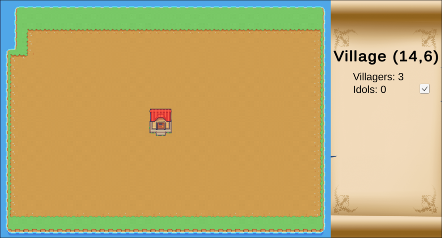
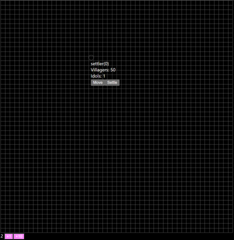

# Alberto

A turn based strategy game.

[Game design docs](docs/)

### Updates

- 2023/01/02 - Restarted development in Unity. Using a Tilemap for the background, and sprites for all other game objects. VillageInfo is in a prefab that is instantiated in a Village script (which shares a private VillageStats object with VillageInfo to drive the UI).
  
- 2022/11/25 - Added settler unit that can move on map and settle in place. State management is becoming increasingly complex, and development rate is slowing to a dead stop. Need to consider re-building the state management using hooks (instetad of context), or switching tech stacks entirely.
  
